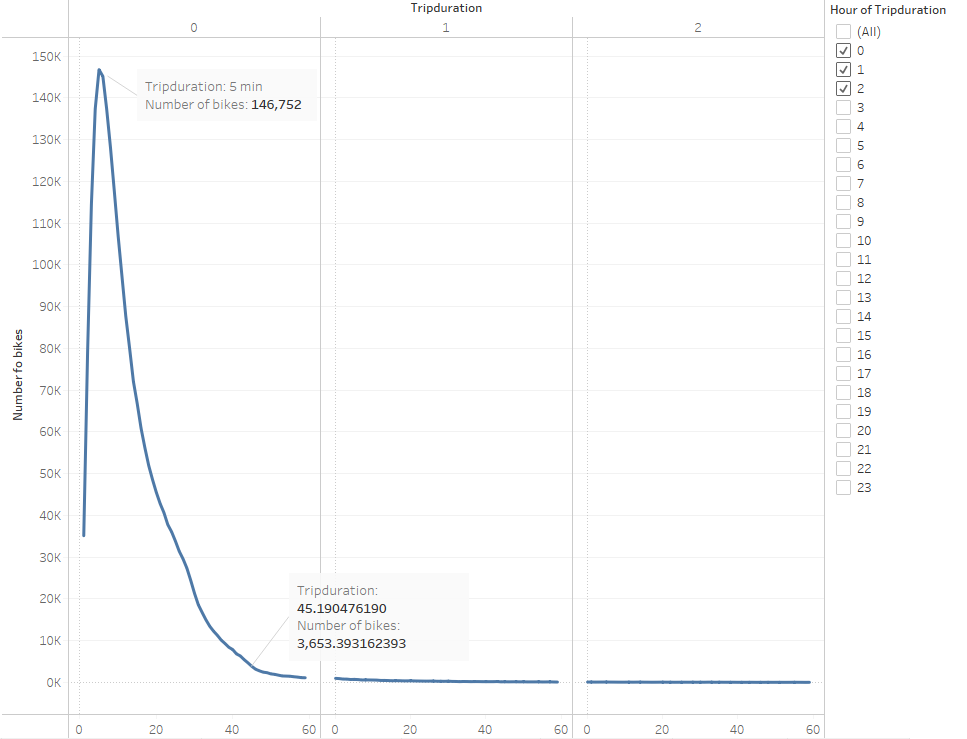
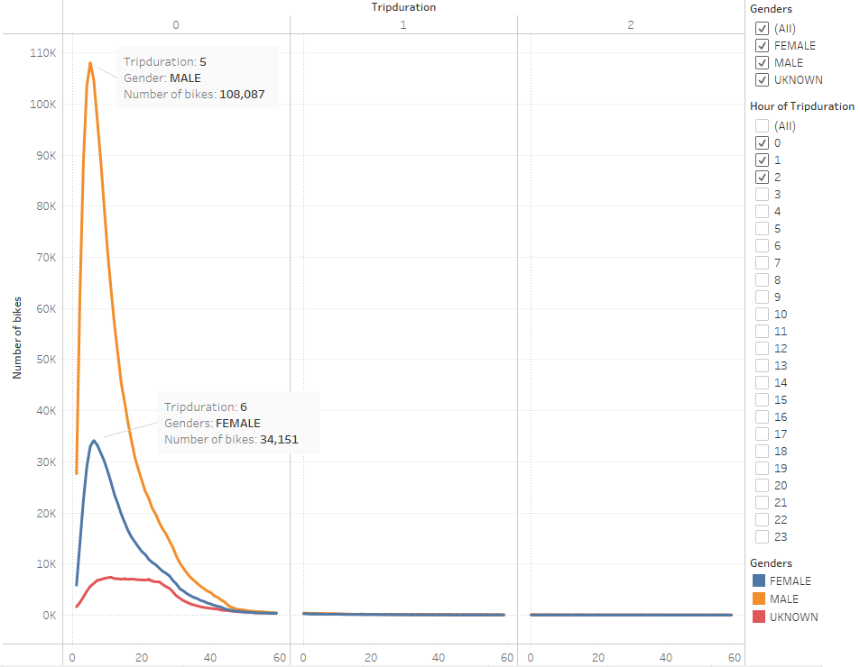
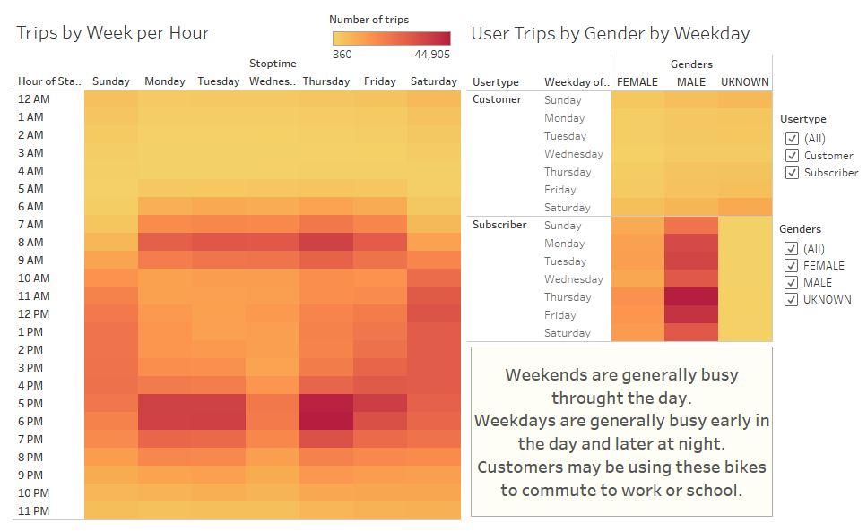
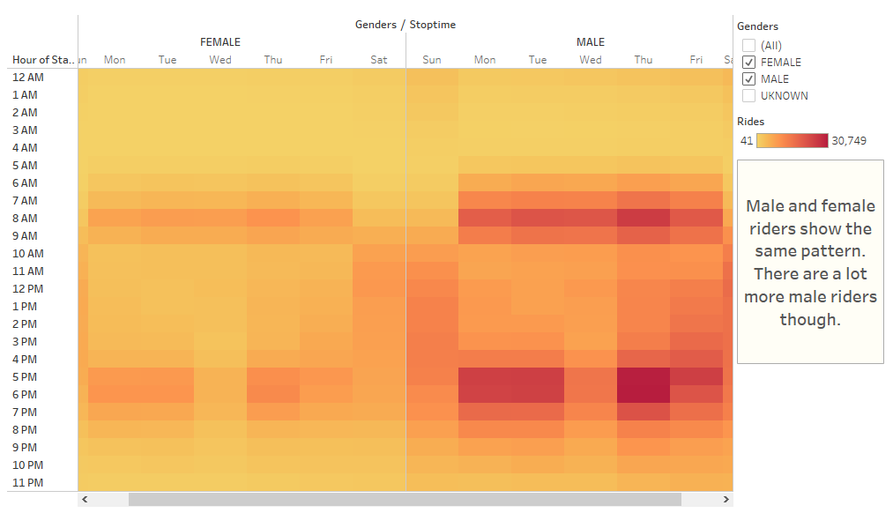
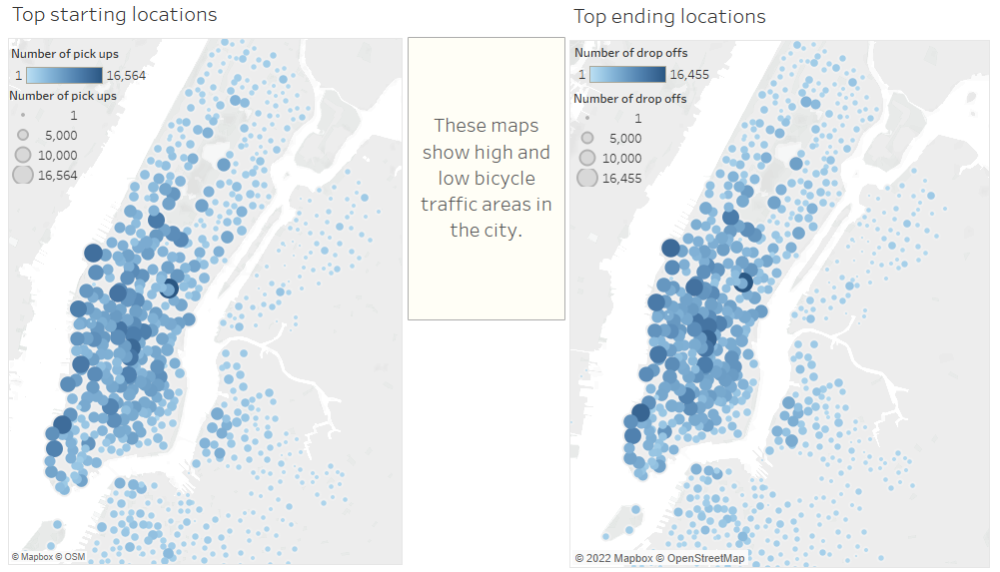

# Bikesharing
## Overview
Citibike is a privately owned public bicycle sharing system that serves some of New York City's boroughs. Using some of their data and Tableau, we will try to discover what this data has and find out if we can replicate citibike's success in New York City in another city.
## Results
From tableau.  
  

Most trips last at least 5 minutes and usually no more than 45 minutes.  
  

The above image indicates that the riders are predominantly male, making the primary target market male.  
  

An interesting pattern emerges. Early hours of the morning and late hours at night are the most active. This suggest that most customers use the bike sharing system as a commuting tool. Weekends are equally busy throughout the day, leisure seems to be the sole use!  
  

Both male and female riders seem to use the system in the same way.  
  

When looking at both start and stop locations, we can reveal which areas of the city have a higher bike traffic.
## Summary
Without a doubt New York City is a cyclist city. Every customer uses the bicycle between 5 to 45 minutes and there is a clear weekly pattern that shows high hours of demand. These maps show areas with high bicycle traffic, this areas should be focused on for proper operation and profit.
We have an only scratched the surface, there is a lot more we could discover from this; personally I would like to know more about bicycle use and maintenance, as well as whether longer or shorter trips are more profitable.